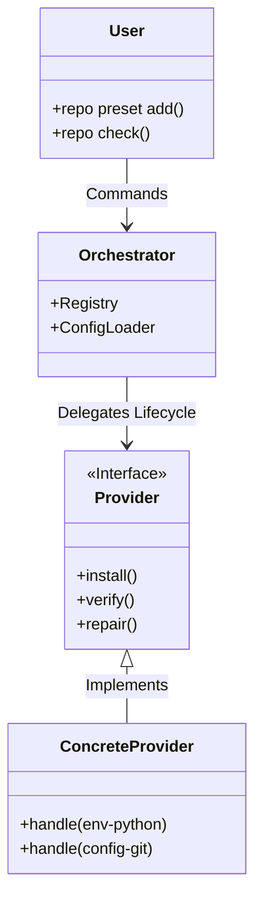

# design/01-architecture-spec.md

## 1. System Overview: The Preset Meta-System

The **Repository Manager** is designed as a modular orchestration layer. At its core lies the **Preset Meta-System**, an architectural pattern that decouples the *definition* of a capability (a "Preset") from its *implementation* (a "Provider").

This approach allows the system to remain generic and extensible, managing diverse resources—from Python virtual environments (`uv`/`conda`) to Node libraries (`npm`/`pnpm`) and configuration files (`.gitignore`)—through a unified interface.

### 1.1 Conceptual Diagram



## 2. Core Entities

### 2.1 The Preset (The "What")

A **Preset** is a declarative request for a capability. It is the "API Contract" between the user's intent and the system's action.

- **Identity**: Defined by a `Type` (e.g., `env`, `config`, `tool`) and a `Variant` (e.g., `python`, `rust`, `docker`).
- **State**: It exists in one of three states:
    1. **Declared**: Listed in the repository configuration.
    2. **Resolved**: Matched to a capable Provider.
    3. **Realized**: Successfully installed/applied to the system.

### 2.2 The Provider (The "How")

A **Provider** is the logic engine responsible for realization. It encapsulates the domain-specific complexity.

- **Responsibility**:
  - Translates high-level config (e.g., "I need Python 3.12") into low-level actions (e.g., "Run `uv venv`").
  - Performs health checks (e.g., "Is the venv corrupted?").
  - Exposes metadata (e.g., "Here is the path to the interpreter").

### 2.3 The Registry (The "Router")

The **Registry** is the central look-up table. It maps specific Preset IDs to their registered Providers.

- *Dynamic Binding*: Allows plugins or optional modules so that `python-conda` support is only loaded if requested.

## 3. The Lifecycle Loop

The system operates on a continuous feedback loop to ensure the "Desired State" matches the "Actual State".

```text
[ Config ] --> (Parse) --> [ Desired State ]
                                  |
                                  v
                           [ Reconciliation ]
                                  |
        +-------------------------+-------------------------+
        |                         |                         |
   (Missing?)                (Drifted?)                (Valid?)
        |                         |                         |
    [ Install ]               [ Repair ]               [ No-Op ]
        |                         |                         |
        +-----------------> [ Actual State ] <--------------+
```

### 3.1 Orchestration Phases

1. **Resolution Phase**: The system scans the configuration and identifies all required presets. It queries the Registry to find a Provider for each.
2. **Verification Phase**: Each Provider is asked to `verify()` its presets. This is a read-only check that returns a status report.
3. **Execution Phase**: Based on the Verification report, the system orchestrates `install()` or `repair()` commands to fix discrepancies.
