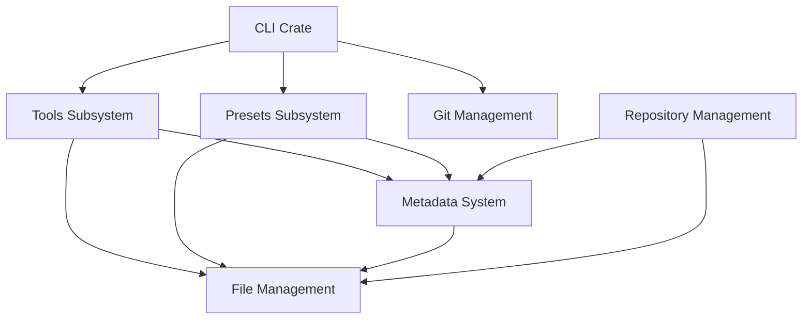

# System Crystallization & Correlation

This document defines how the various subsystems of the Repository Manager interact to form a cohesive whole.

## Architecture Map

## Subsystem Roles

1. **[CLI](cli/spec.md)**: The user-facing entry point. It orchestrates the other subsystems based on user commands.
2. **[Tools](tools/spec.md)**: Defines the universe of "Things that can run". It registers capabilities (Coding Agents, IDEs) into the Metadata System.
3. **[Presets](presets/spec.md)**: The "Doers". They provide capabilities (venv, gitignore) and modify the repository state accordingly.
4. **[Metadata System](metadata-system/spec.md)**: The central registry in `.repository` that tracks what Tools and Presets are active.
5. **[File Management](file-management/spec.md)**: The robust foundation layer. Handles all disk I/O with error recovery, serving as the utility belt for Tools and Presets.
6. **[Git Management](git-management/spec.md)**: Handles syncing and worktrees, often changing the physical layout which the File Management system operates on.
